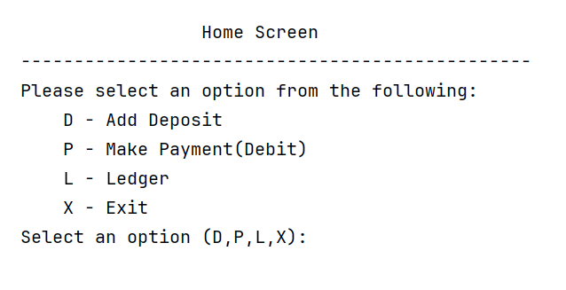
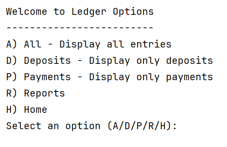
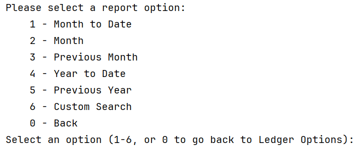
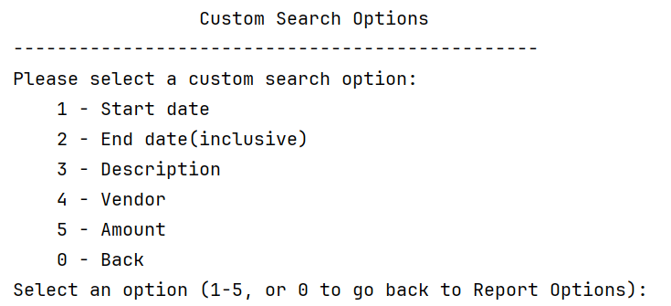
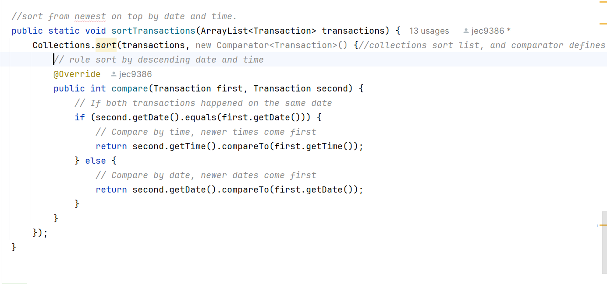

# Budget Tracker (Java Console Application)

A simple command-line budget tracking application built in Java. Users can add transactions, view deposits and payments, and generate reports based on date, vendor, description, or amount.

---

## Features

- Add **Deposits** and **Payments**
- View **All Transactions**
- Filter transactions by:
  - **Description**
  - **Vendor**
  - **Amount** (positive or negative)
  - **Start Date to Today**
  - **Custom End Date**
- Generate reports (Month-to-date, Year-to-date, etc.)
- Data stored in `.csv` format for easy readability and persistence

---
## Interface Preview

### Home Menu



### Ledger Options



### Report Options



### Custom Search Options



### Interesting piece of code



### Explanation

This method sorts all transactions so the newest entries appear at the top of the list.

It uses `Collections.sort()` along with a `Comparator` to define a custom sorting rule.

- First, it checks if two transactions happened on the same date:
  - If so, it compares their times, placing newer times before older ones.
- If the dates are different, it compares the dates, placing newer dates before older ones.

### Reflection

It took me a while to understand how comparing dates and times works in Java, especially when using custom sorting logic with Comparator. After testing and breaking it down, I realized how powerful this pattern is for organizing time-sensitive data like financial transactions. This sorting logic is used consistently before any display action to ensure users always see the most recent information first.

---
## File Structure
```
/BudgetBuddy
├── Main.java         # Entry point and main navigation
├── Transaction.java  # Transaction object manipulation
├── Reports.java      # Implement report screen and methods
├── Ledger.java       # Implement ledger screen and methods
├── CustomSearch.java # Implement custom search screen and methods
├── Console.java      # Methods for prompting and formatting input and output

```


